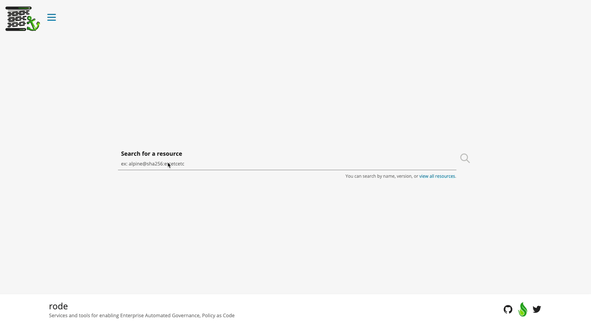
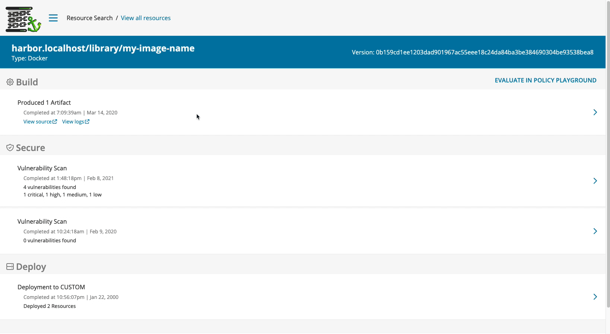
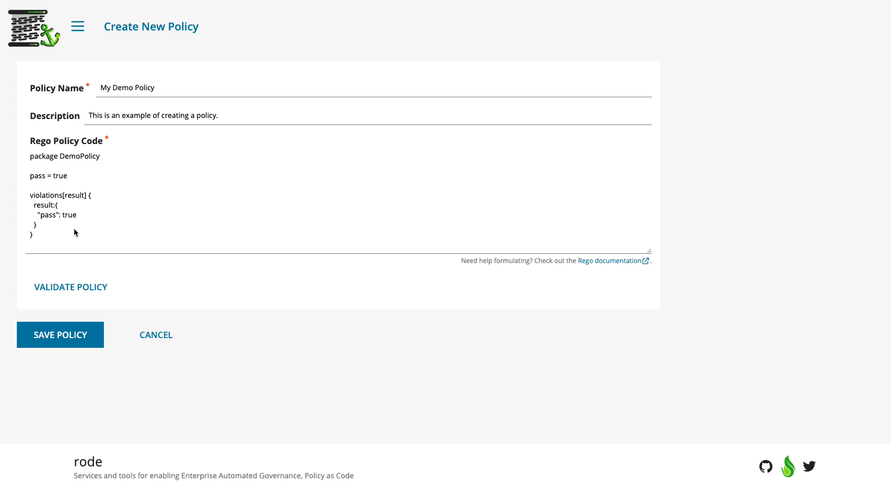
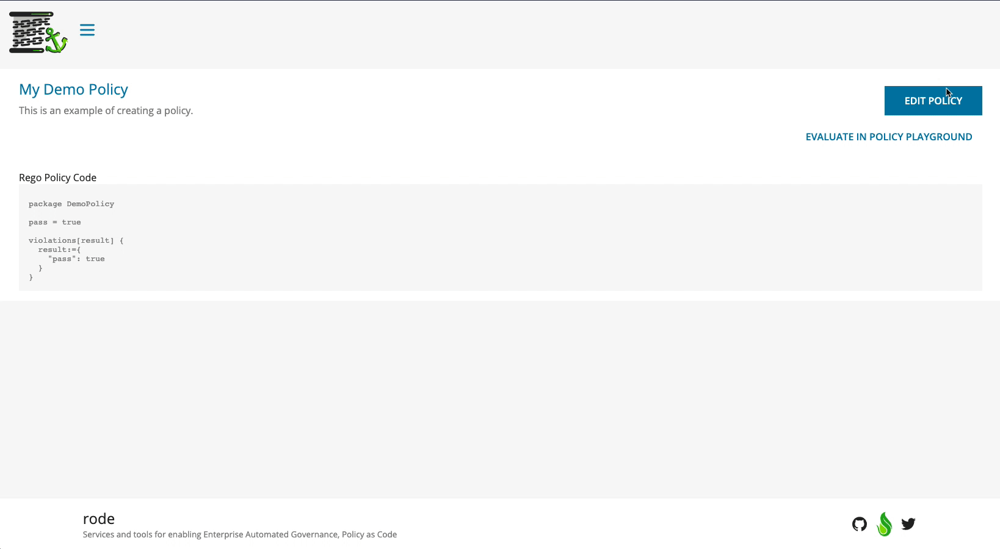
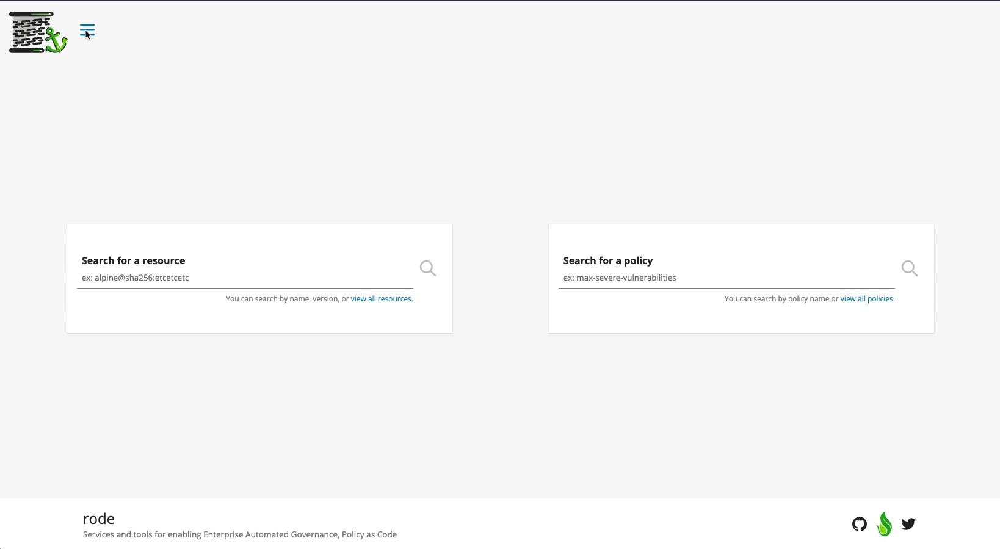

# rode-ui

The Rode UI provides a user-focused experience for interacting with metadata and policy. It communicates directly with [Rode](https://github.com/rode/rode) and provides an opinionated view for viewing, managing, and organizing the entities required for building a system of Automated Governance.

## Features

### Resources

The metadata collected by Rode is surfaced in the UI through a resource. A **resource** can represent a variety of subjects, determined by the [collectors](https://github.com/rode/rode/blob/main/docs/collectors.md) used in your instance of Rode.

#### Resource Search

**Resources** can be found by searching for the resource name. The name does not have to be an exact match, but it must include the appropriate delimiters.

> **Example**  
> Given a resource named `harbor.rode.lead.prod.liatr.io/rode-demo/rode-demo-node-app`  
> Valid searches: `"demo"`, `"rode-demo-node-app"`, `"rode-demo"` , `"rode-demo/rode-demo-node-app"`  
> Failed searches: `"rode demo"`, `"harbor demo"`

#### Resource Occurrences

The metadata of a given resource is sent to Rode in the form of **occurrences**, a structured piece of data that corresponds with the type of metadata that is being collected. When viewing a specific resource, you will see a list of occurrences that have been collected. Some occurrences will be grouped with others, like the case of a vulnerability scan, to help give a clear picture of related occurrences. You can click on an occurrence to learn more and to see the original metadata that was sent to Rode.

### Policies

#### Policy Search

**Policies** can be found by searching for the policy name. Similar to searching for a resource, the name does not have to be an exact match but must include the appropriate delimiters.

> **Example**  
> Given a resource named `Max Vulnerability Policy`  
> Valid searches: `"max"`, `"max vulnerability policy"`, `"vulnerability"` , `"policy"`  
> Failed searches: `"max policy"`, `"vulnerability-policy"`

#### Policy Creation and Validation

**Policies** can be created using the Rode UI. To assist you in building valid Rego code, you can validate the code before you save. Validating the Rego code will give you feedback on issues that will prevent your policy from compiling. This validation will also run when you save the policy, so you will not be able to create an unusable policy through the Rode UI.

#### Policy Edit and Delete

Once a policy has been created, you can view the policy and it's Rego code at any time. When viewing the policy details screen, you can also edit or delete a policy that was created through the UI.

### Policy Playground

The Policy Playground can be used to evaluate a resource against a policy. This can be useful when testing policy logic or seeing if a resource meets a set of requirements. Within the policy playground, you can search for a resource or policy to evaluate. If you are viewing the details of a specific resource or policy, there is a button to `Evaluate In Policy Playground` that will populate the resource or policy in the playground for you.

Once a policy and a resource have been selected, you can evaluate to see how the resource faired against the policy. If a resource fails against a policy, an explanation of the failures will be available to view.

### Dark Mode

To provide the best user experience possible the Rode UI has a dark mode, which you can find in the main navigation. Your preference will be remembered between sessions.

## Development

### Local Development

To run `rode-ui` locally, you'll need Node.js, [`yarn`](https://yarnpkg.com/), and, optionally, [`nvm`](https://github.com/nvm-sh/nvm).

You'll also need to have [Rode](https://github.com/rode/rode) running -- by default the application expects Rode to be on `http://localhost:50051`.
To configure a different URL, set the environment variable `RODE_URL`.

1. Configure the Node.js version with `nvm use`.
1. Install dependencies with `yarn`.
1. Start the application using `yarn dev`.
1. Run [`pretter`](https://prettier.io/), [`eslint`](https://eslint.org/), and tests with `yarn verify`.
1. Fix any formatting errors using `yarn fmt`.

### Integration Testing

Integration testing for `rode-ui` are implemented using [`Cypress`](https://www.cypress.io/) and [`Cucumber`](https://github.com/TheBrainFamily/cypress-cucumber-preprocessor). Before running the integration tests for the first time, you may need to run `yarn install`.

1. Run the `rode-ui` locally by following the instructions above. Keep the application running in your terminal.
1. In a second terminal window, open the Cypress test runner by running `yarn e2e`. This will open a new application window on your computer.
   1. If you want to run the tests by hitting a locally run copy of [Rode](https://github.com/rode/rode), you can instead run the command `yarn e2e-local`. _Please note: some of the test assertions are based on the mocked responses, so running the tests against your local instance may result in test failures._
1. Run all tests by selecting the button in the top right of the test window, or run an individual test file by selecting the name of the file. For example, to run resource tests you can select `Resources.feature` from the list.
1. You can close Cypress by exiting the test runner window or by pressing `ctrl + c` in the terminal window where you ran `yarn e2e`.
